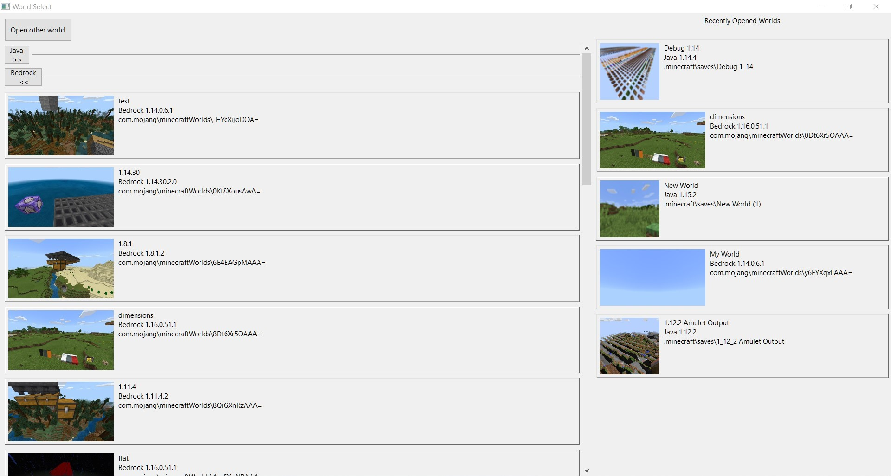

# Amulet Documentation

When you open Amulet you should be greeted by a screen that looks similar to the image below.

First of all backup any worlds that you intend to edit just in case they get corrupted when editing.

Click on the open world button and a new window should appear that looks like the image below.

On the left should be some expandable panes containing the worlds stored in the respective directories. Click on the button to show the worlds in that location. 

Click on a world to open it with Amulet.

If you wish to open a world from a different location press the "open other world" button and select the world folder.

On the right will be worlds that you have recently opened in Amulet (this will be blank if you have not opened any worlds yet).

There are some cases where you will not see a world listed or are not able to open a listed world. If it is a Java world it may be because the world was opened with Forge. We do not currently support opening these worlds but we would like to support them in the future. If this is not the case I would suggest reaching out to us either through [discord](https://discord.gg/BTm6jnf) or twitter and we will try and help you.

Once you have opened a world you should see a screen that looks like the image below.

On the top are the worlds that you currently have open in Amulet to make it easy to switch between. More worlds can be opened at the same time either by selecting the main menu and opening again or through File -> Open World

On the left are the different sub-programs contained within Amulet. The documentation for which can be found below.

[Convert Program Documentation](plugins/programs/convert/readme.md)

[Edit Program Documentation](plugins/programs/edit/readme.md)

